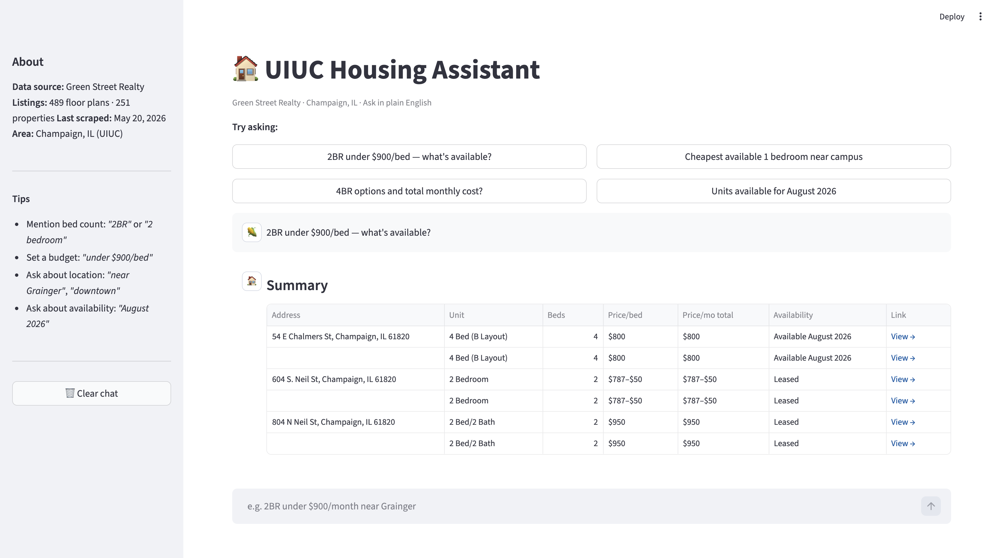

# 🏠 UIUC Housing Assistant

An AI-powered housing search tool for UIUC students. Ask in plain English — get real, ranked listings from Champaign landlords.

> *"2 bedroom under $900/bed near campus"* → instant results from Green Street Realty, with prices, availability, and direct links.

## What It Does

Most UIUC students search for housing on Apartments.com or Craigslist, where listings are often stale, mis-priced, or already rented. This tool goes directly to the source — scraping major Champaign landlords — and lets students search using natural language instead of filters.

Built as an original portfolio project to demonstrate production-ready AI engineering skills: RAG pipeline design, local LLM integration, web scraping, and full-stack deployment.

## Demo

Next.js + React chat UI backed by a FastAPI server — ask a question, get listing cards and a sortable comparison table with address, unit type, price range, availability, and a direct link.




## Architecture — RAG Pipeline

The system runs in two phases: **Build** (index listings into Chroma once) and **Query** (answer each student question).

### Query pipeline — 5 steps

1. **LLM extracts structured parameters** — `"2BR under $900 near Grainger"` → `{beds: 2, max_price_per_bed: 900, location_hint: "Grainger"}`
2. **Chroma metadata pre-filter** — narrow the candidate pool by exact criteria (price, beds, availability) before touching vectors
3. **Semantic similarity retrieval** — embed the query with `all-MiniLM-L6-v2`; rank the filtered pool (k=50); trim off-topic results by score gap
4. **Proximity filter** — Haversine formula drops listings farther than 0.5 mi from the named landmark
5. **LLM generates summary** — retrieved listings are passed as context; LLM writes one sentence summarizing what was found

This is standard RAG: **Retrieve → Augment LLM context → Generate.**

### AI tech stack

| Component | Technology |
|---|---|
| Vector database | ChromaDB — semantic search |
| Embedding model | `all-MiniLM-L6-v2` (HuggingFace Sentence Transformers, runs locally, bundled into Railway) |
| Structured output extraction | LLM parses natural language query into a JSON filter object |
| Hybrid retrieval | Vector similarity + metadata exact-match filter combined |
| LLM (production) | Groq API — `llama-3.1-8b-instant` |
| LLM (local dev) | Ollama — `llama3.1:8b` |
| RAG framework | LangChain (`langchain-chroma`, `langchain-huggingface`, `langchain-groq`, `langchain-ollama`) |

For annotated pipeline diagrams and LangChain LCEL chain details, see [`design_docs/ai-pipeline.md`](design_docs/ai-pipeline.md).

---

## Tech Stack

| Layer | Technology |
|---|---|
| **Scraping** | Playwright (headless Chromium) |
| **Database** | SQLite (versioned snapshots in `snapshots/`) |
| **Backend** | FastAPI + Uvicorn |
| **Frontend** | Next.js (React, TypeScript, Tailwind) |
| **Deployment** | Railway (backend) + Vercel (frontend) |
| **Language** | Python 3.14 / TypeScript |


## Project Structure

```
uiuc-housing-assistant-langchain-rag/
├── scrapers/
│   └── green_street.py         # Playwright scraper → green_street_raw.json
├── pipeline/
│   ├── normalize_green_street.py  # Cleans raw JSON → snapshots/listings_YYYY-MM-DD.db
│   └── ingest.py               # Incremental Chroma update (add/update/delete by stable ID)
├── rag/
│   └── rag_chain.py            # Retriever + LangChain LCEL chain
├── backend/
│   └── main.py                 # FastAPI — POST /api/search
├── frontend/                   # Next.js (React, TypeScript, Tailwind)
│   ├── app/
│   │   ├── page.tsx            # Chat UI, message state, form handling
│   │   └── layout.tsx
│   ├── components/
│   │   ├── AssistantMessage.tsx # Listing cards + summary table
│   │   ├── SummaryTable.tsx    # Sortable comparison table
│   │   ├── ListingCard.tsx
│   │   ├── UserBubble.tsx
│   │   └── Sidebar.tsx
│   └── lib/api.ts              # search() + TypeScript types
├── snapshots/                  # Versioned SQLite snapshots + raw JSON archives
│   ├── latest.txt              # Points to most recent snapshot date
│   ├── listings_YYYY-MM-DD.db
│   └── raw_YYYY-MM-DD.json
├── chroma_db/                  # Chroma vector store (incremental, single directory)
├── config.py                   # Shared constants (model names, paths)
├── design_docs/                # Phase design docs and architecture notes
└── app.py                      # Legacy Streamlit UI (superseded by Next.js frontend)
```


## Setup

### 1. Clone and create a virtual environment

```bash
git clone <your-repo-url>
cd uiuc-housing-assistant-langchain-rag
python3 -m venv .venv 
source .venv/bin/activate
```

### 2. Install Python dependencies

```bash
pip install -r requirements.txt
playwright install chromium
```

### 3. Install Node.js dependencies (frontend)

```bash
cd frontend && npm install && cd ..
```

> **Note:** You only need to reinstall dependencies if you delete `.venv`, clone the repo to a new machine, or move the project to a different folder. For normal day-to-day use, just `source .venv/bin/activate` and skip straight to running the app.

### 4. Install and start Ollama

```bash
brew install ollama
brew services start ollama
ollama pull llama3.1:8b
```


## Running the Pipeline

### Data pipeline (run once, then re-run whenever you want fresh listings)

```bash
# Step 1 — Scrape Green Street Realty
python scrapers/green_street.py
# → green_street_raw.json

# Step 2 — Normalize and snapshot
python -m pipeline.normalize_green_street
# → snapshots/listings_YYYY-MM-DD.db  (skipped if data unchanged vs last snapshot)

# Step 3 — Incremental Chroma update
python -m pipeline.ingest
# → chroma_db/  (only adds/updates/deletes what changed; first run ~90 MB model download)
```

### Launch the app (two terminals)

**Terminal 1 — Backend:**
```bash
source .venv/bin/activate
Q# → http://localhost:8001
```

**Terminal 2 — Frontend:**
```bash
cd frontend && npm run dev
# → http://localhost:3000
```


## Data Sources

| Company | Status | Method |
|---|---|---|
| **Green Street Realty** | ✅ Live | Playwright scraper |
| Universities Group | 🔜 Planned | Playwright scraper |
| MHM Properties | 🔜 Planned | Playwright scraper |
| Here 707 | 🔜 Planned | TBD |
| Hub on Campus | 🔜 Planned | TBD |

All scrapers respect each site's `robots.txt` and `Crawl-delay` directive.


## Roadmap

- [ ] Add Universities Group scraper
- [ ] Add MHM Properties scraper
- [ ] Weekly auto-refresh scheduler (`refresh.py`)
- [ ] Deploy to Railway with OpenAI API swap
- [ ] Distance-to-campus filter
- [ ] Saved searches / favorites


## Acknowledgements

Learning path inspired by [瓦子's guide on Xiaohongshu](https://www.xiaohongshu.com/explore/69c9a6400000000023021345) on breaking into AI engineering roles. RAG architecture based on AI Jason's LangGraph tutorials.
