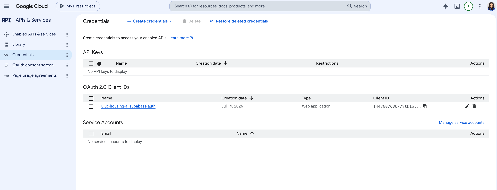
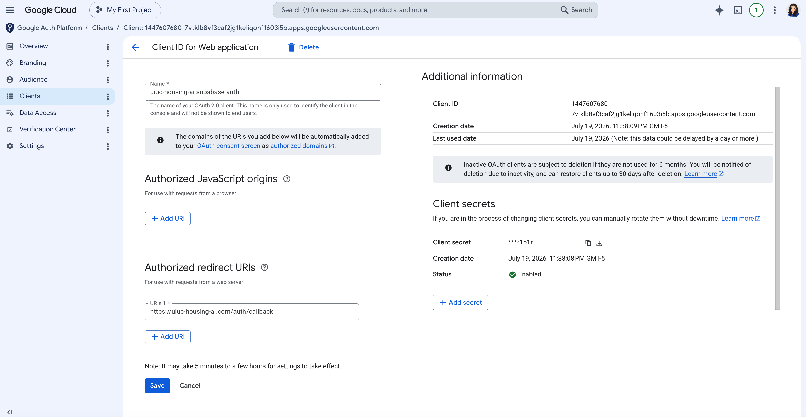

# Google Sign-In: Google Cloud OAuth Client Setup

**Created: 2026-07-19**

**Builds on:** `design-docs/post-launch/open-registration.md` (the Google button this makes work) · `design-docs/user-authentication.md` (the overall auth model)

**Status:** live and verified. Google login works end to end as of 2026-07-19.

**Goal:** configure the Google Cloud OAuth client so "Continue with Google" completes instead of failing with `Error 400: redirect_uri_mismatch`.

**Non-goals:** the Supabase-side provider setup, the login UI, the consent screen review. Those were already done. This doc covers only the redirect and origin config that was blocking sign-in.

## 1. Why this step

Sign-in failed at the first hop: pick a Google account, get "Access blocked: this app's request is invalid", `redirect_uri_mismatch`. No application code is involved. It is entirely Google Cloud Console config.

The one fact that explains it: **Google never sees our app's address.** Login is three hops, not two.

```
browser  ->  accounts.google.com          user picks account
         ->  <project>.supabase.co        Supabase exchanges the code, mints a session
         ->  our app /auth/callback       app finishes login
```

Supabase is Google's OAuth client, not us. So the redirect Google validates is Supabase's callback. Our own `/auth/callback` is hop three, which Google never learns about. The login component does pass an app-side redirect target, but Supabase consumes that on hop three; it never reaches Google's check.

That is why registering only our own callback looks right and fails every time.

> **What's a redirect URI allowlist:** Google only hands the authorization code back to an address registered in advance, so an attacker cannot start a login with your client ID and have the result delivered to their server. It is an exact string match, which is why a stray path fails outright.

## 2. Setup, step by step

### Step 1. Open the Web application client

Google Cloud Console → APIs & Services → Credentials → OAuth 2.0 Client IDs → the Web application client.

Direct link: https://console.cloud.google.com/apis/credentials



### Step 2. Add Supabase's callback to Authorized redirect URIs

This is the fix. The URI has to be Supabase's callback for our project, spelled exactly, including the `/auth/v1/callback` suffix, for the reason in section 1: that is the address in the request Google actually receives.

The screenshot below is the pre-fix state. Origins empty, and redirect URIs holding only the app's own callback. That existing line is harmless and Google never uses it, but it also fixes nothing, which is exactly why the error was confusing. The Supabase line is what has to be added.



Why not skip Supabase and talk to Google directly: we would own token exchange, refresh, and session minting, which is the work Supabase is here to do, and it would break the session model the rest of the product already uses.

### Step 3. Leave Authorized JavaScript origins empty

The console puts origins right above redirect URIs, which makes them look like a pair to fill in together. They serve different flows.

Origins matter for the in-page sign-in widget, where a script on our domain calls Google over the network and the browser enforces cross-origin rules. Ours is a full-page redirect: the browser navigates away, and our domain never makes a cross-origin request. Google does not check an origin it was never sent.

So leave it empty. Not because filling it breaks anything, but because an empty field cannot be filled in wrong. If entries are already there, the two fields take opposite formats, and copying a value across produces an error that looks like the value itself is bad:

| Field | Format | Example |
|---|---|---|
| Authorized redirect URIs | Full URL, path required | `https://<project-ref>.supabase.co/auth/v1/callback` |
| Authorized JavaScript origins | Scheme, host, port only, path forbidden | `http://localhost:3300` |

An origin carrying a path is rejected: "URIs must not contain a path or end with /". Strip the path, or delete the entry.

Save. Google's changes are not instant, the console says 5 minutes to a few hours.

### Step 4. Confirm the Supabase side

Two things on the Supabase dashboard, both of which were already correct here but fail in ways that get blamed on Google:

- **Supabase dashboard → Authentication → Providers → Google:** the client ID and secret belong to this OAuth client, not an older one.
- **Supabase dashboard → Authentication → URL Configuration → Redirect URLs:** the app's own callback is allowlisted for local and production, so hop three is permitted.

## 3. What changed, and where

| Where | What | New / Change | Status |
|---|---|---|---|
| Google Cloud Console → APIs & Services → Credentials → the Web application client → Authorized redirect URIs | Add Supabase's callback | **New** | Done 2026-07-19 |
| Same screen → Authorized JavaScript origins | Leave empty, or strip the path from any existing entry | Change | Done 2026-07-19 |
| Supabase dashboard → Authentication → Providers → Google | Confirm the client ID and secret match this OAuth client | Change | Verified |
| Supabase dashboard → Authentication → URL Configuration → Redirect URLs | Confirm the app's own callback is allowlisted for local and production | Change | Verified |

## Deliverable

Clicking "Continue with Google" reaches the account picker, and picking an account lands back in the app signed in, no error page.

Two failure modes look similar and have different causes:

| Symptom | Cause |
|---|---|
| Fails at Google, 400 `redirect_uri_mismatch` | Google Cloud redirect URI list, step 2 |
| Google succeeds, then the return to the app errors or bounces home | Supabase's own redirect allowlist, step 4 |

If the first retry after saving fails identically, wait a few minutes before assuming the value is wrong.

## Appendix - build-time specifics (skip on a first read)

**Google Cloud Console → APIs & Services → Credentials → the Web application client → Authorized redirect URIs** (the second line is the one that matters):

```
https://uiuc-housing-ai.com/auth/callback
https://uknyhpwzvdevxfxkpxmy.supabase.co/auth/v1/callback
```

**Same screen → Authorized JavaScript origins**, if kept rather than emptied:

```
http://localhost:3300
https://uiuc-housing-ai.com
```

**Supabase dashboard → Authentication → URL Configuration → Redirect URLs:**

```
http://localhost:3300/auth/callback
https://uiuc-housing-ai.com/auth/callback
```

**Where the app-side redirect is set:** `frontend/components/auth/LoginCard.tsx`, in the Google sign-in handler. It passes the current origin plus `/auth/callback`, derived at runtime so local and production both work with no build-time switch. This is the hop-three target Supabase consumes.

**Project ref:** the host of `NEXT_PUBLIC_SUPABASE_URL` in `frontend/.env.local`. The redirect URI is that host plus `/auth/v1/callback`.

**Local port:** 3300, per this project's port allocation.
